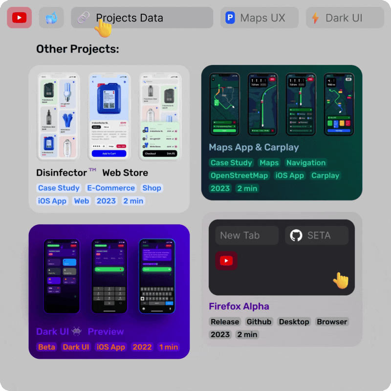

<h2>Firefox-Alphα :moyai: Super clear desktop browser</h2>

<h3>
<a href="https://github.com/Tagggar/Firefox-Alpha/blob/main/README.md#arrow_down-install">:arrow_down: Install</a>
 &nbsp;&nbsp;&nbsp; 
<a href="https://github.com/Tagggar/Firefox-Alpha/issues/">:space_invader: Report Bug</a>
</h3>

### Fast and minimal Firefox configuration with zero buttons, for simplicity and intuitive gesture controls. 

### Features:

* [x] [Combined Tab and Urlbar](#combined-tab-and-urlbar)
* [x] [Multi-row Tabs](#multi-row-tabs)
* [x] [Multi-row Bookmarks](#multi-row-bookmarks)
* [x] [New Clean Menu](#new-clean-menu)
* [x] [New Downloads Bar](#new-downloads-bar)
* [x] [Simple Finbar](#simple-findbar)
* [x] [Adaptive Color](#adaptive-color)
* [x] [Gesture navigation](#gesture-navigation)
* [x] [Security](#security)

&nbsp;

&nbsp;

### Combined Tab and Urlbar

Greatly enhances usability and provides a more intuitive browsing experience, eliminating the need for constant switching between UI sections.

`LMB` on Active Tab to select url;

`MMB` on Inactive Tab to Close;

`MMB` on empty space to open New Tab;

:monocle_face: Rare glitches may occur due to CSS limits.

&nbsp;

### Multi-row Tabs

Stacking tabs into multiple rows enhances tabs access, simplifies navigation, and optimizes screen space, ensuring efficient multitasking and improved user experience:

`RMB` on Tab to open Tab controls (Pin/Mute/Bookmark/...);

:round_pushpin: Pinned Tabs are set to the left corner;

:mute: The Audio Tab is nicely highlighted, and excessive [Playing] indication removed; 

:ok_hand: Expect perfect UI consistency.

&nbsp;

### Multi-row Bookmarks

Bookmarks are now organized in multiple rows below the Tabs, improving accessibility and resource management, especially for users with a large number of bookmarks:

Add `History` / `Downloads` to Bookmarks Panel for quick access;

:point_right: `Bookmarks Toolbar` > `Show only on New Tab` to display Bookmarks only on New Tab;

:x: Useless folder icons are removed. Now You can add `💪 Emojis` to folder names for better visual identification. 

&nbsp;

### New Clean Menu

New consistent Main Menu design, with clear and uniform UI, ensures efficient access to key features. Unnecessary elements are removed to simplify the layout and navigation.

`Alt` / `Option` to open Main Menu with access to all browser features and controls from one place;

:link: Menu can be customized with **[simpleMenuWizard](https://github.com/stonecrusher/simpleMenuWizard)**.

&nbsp;

### New Downloads Bar

New Downloads identificator and simple status panel are now with human design.

&nbsp;

### Simple Findbar

`Ctrl+F` to find on webpage quickly. Findbar now natively integrated into UI. 

&nbsp;

### Adaptive Color

🔗 **[Adaptive Tab Bar Colour](https://github.com/easonwong-de/Adaptive-Tab-Bar-Colour#adaptive-tab-bar-colour)** - extension is required to make browser UI match the website color.

:warning: Configure in the Extension Settings:

* [x] Allow light tab bar

* [x] Dynamic color update

* [x] Ignore designated color

&nbsp;

### Gesture navigation

🔗 **[Gesturefy](https://github.com/Robbendebiene/Gesturefy#esturefy)** - extension is required if your OS doesn't support native gesture controls. 

:warning: Configure gestures in the Settings:

:arrow_left: `Swipe-Right` to go `Back`

:arrow_right: `Swipe-Left` to go `Forward`

:arrows_clockwise: `Pull-Down` to `Reload`

&nbsp;

### Security 

🔗 **[ uBlock Origin](https://github.com/gorhill/uBlock#ublock-origin-ubo)** - efficient wide-spectrum content blocker. It blocks ads, trackers, miners, popups, malware and other web annoynances. Follow the configuration guides and your personal preferences for faster and secure web surfing.

&nbsp;

<!-- Install -->
## :arrow_down: Install:

1. In `about:support` > open Firefox profile folder and put `chrome` folder:
    
    📂 `...` `/` `firefox profile` `/` `chrome` `/` `userChrome.css`
    
    📂 `...` `/` `firefox profile` `/` `chrome` `/` `userContent.css`

2. In `about:config` set:

    `toolkit.legacyUserProfileCustomizations.stylesheets` > `true` to enable custom themes; 

    `browser.urlbar.clickSelectsAll` > `true` for url selection in single click;

