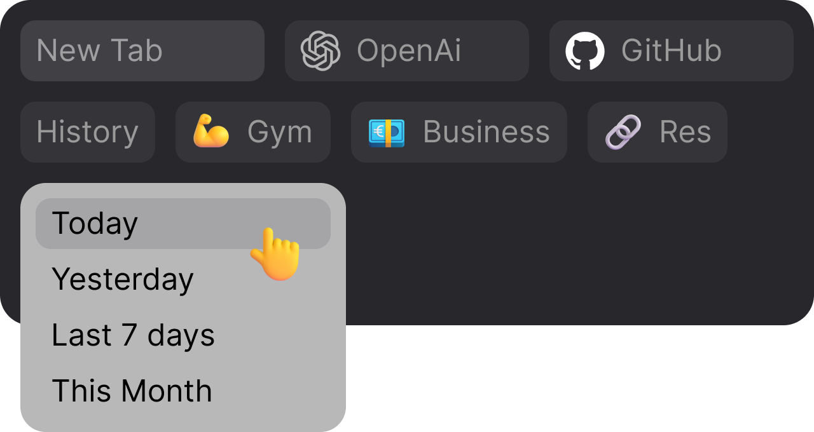
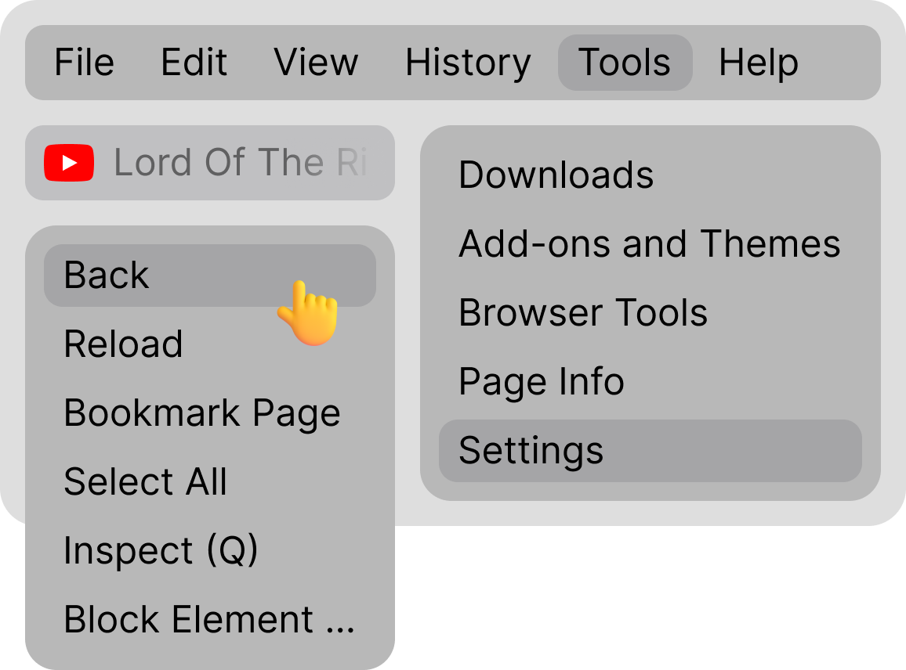
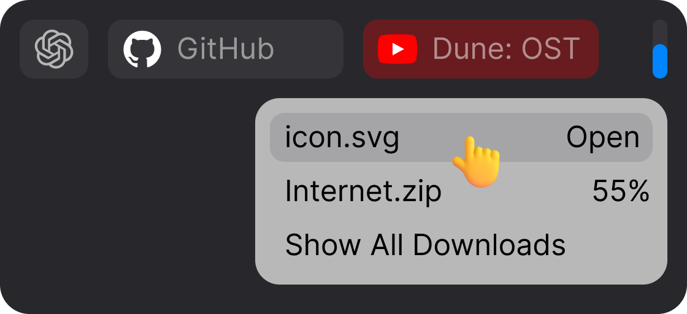

<h2>Firefox-Alphα :moyai: Super clear desktop browser</h2>

<h3>
<a href="https://github.com/Tagggar/Firefox-Alpha/blob/main/README.md#star2-install">:arrow_down: Install</a>
 &nbsp;&nbsp;&nbsp; 
<a href="https://github.com/Tagggar/Firefox-Alpha/blob/main/README.md#space_invader-add-extensions">:heavy_plus_sign: Add Extensions</a>
 &nbsp;&nbsp;&nbsp; 
<a href="https://github.com/Tagggar/Firefox-Alpha/issues/">:space_invader: Report Bug</a>
</h3>

### Master Firefox configuration for simplicity and intuitive controls

- Simple and intuitive UI with zero buttons;
- Fast and light;
- [Combined Tab and Urlbar](#star2-about-the-project)
- Intuitive gesture-based navigation;
- Zero buttons and distractions.

&nbsp;

<h3>Multi-row Tabs</h3>

&nbsp;

:mute: The Audio Tab is nicely highlighted, and excessive [Playing] indication clutter is removed;

:dart: Pinned Tabs are set to the left for quick access;

:ok_hand: Expect perfect UI consistency.

&nbsp;&nbsp;

 

<h3>Combined Tab and Urlbar</h3>

Greatly enhances usability and provides a more intuitive browsing experience, eliminating the need for constant switching between UI sections.

:computer_mouse: `LMB` on Active Tab to select url;

:computer_mouse: `MMB` on Inactive Tab to Close;

:computer_mouse: `MMB` on empty space to open New Tab;

:monocle_face: Rare glitches may occur due to CSS limits.

&nbsp;&nbsp;

 

<h3>Multi-row Bookmarks</h3>

Add `History` / `Downloads` to Bookmarks Panel for easy access;

:point_right: `Bookmarks Toolbar` > `Show only on New Tab` to display Bookmarks only on New Tab;

:x: Useless folder icons are removed. Now You can add `💪 Emojis` to folder names for better visual identification. 

&nbsp;&nbsp;

 

<h3>New Clean Menu</h3>

New Menu design with clear UI. Unnecessary elements are removed.

:link: Menu can be customized with [simpleMenuWizard](https://github.com/stonecrusher/simpleMenuWizard) to remove multiple unwanted items.

&nbsp;&nbsp;

 

  <h3>New Downloads Bar</h3>

New Downloads identificator and simple status panel are now with human design.

&nbsp;&nbsp;

 

  <h3>Simple Findbar</h3>

`Ctrl+F` to find on webpage quickly. Findbar now natively integrated into UI. 

---
<!-- Install -->
## :arrow_down: Install:

1. In `about:support` > open Firefox profile folder and put files inside `chrome` folder:
    
    📂 `...` `/` `firefox profile` `/` `chrome` `/` `userChrome.css`
    
    📂 `...` `/` `firefox profile` `/` `chrome` `/` `userContent.css`

2. In `about:config` set:

    `toolkit.legacyUserProfileCustomizations.stylesheets` > `true` to enable custom themes; 

    `browser.urlbar.clickSelectsAll` > `true` for url selection in single click;

    `browser.compactmode.show` > `true` to enable Compact Mode.

### :heavy_plus_sign: Add Extensions:

**[Adaptive Tab Bar Colour](https://github.com/easonwong-de/Adaptive-Tab-Bar-Colour#adaptive-tab-bar-colour)** - to make browser UI match the website color;

**[Gesturefy](https://github.com/Robbendebiene/Gesturefy#esturefy)** - to browse faster with mouse gestures;

**[uBlock Origin](https://github.com/gorhill/uBlock#ublock-origin-ubo)** - the only security extension You need.
